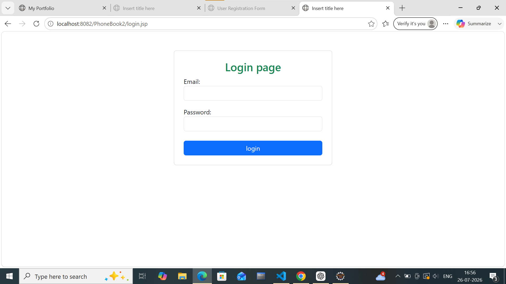

# Phonebook Management System

## Description
Phonebook Management System is a Java web application that allows users to securely manage their contacts. The application includes user authentication and supports complete CRUD operations with Oracle SQL database connectivity.

## Features
- User Registration
- User Login & Logout
- Add New Contact
- View All Contacts
- Update Contact Details
- Delete Contacts
- Session Management

## Technologies Used
- Java
- JSP
- Servlets
- JDBC
- Oracle SQL
- HTML
- CSS
- Bootstrap
- Apache Tomcat

## Project Structure
- Frontend: HTML, CSS, Bootstrap, JSP
- Backend: Java Servlets, JDBC
- Database: Oracle SQL
  ## Screenshots

### Login Page

## Author
Charan
